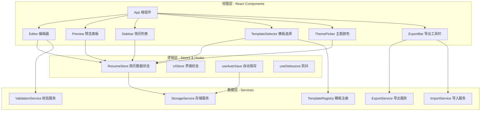
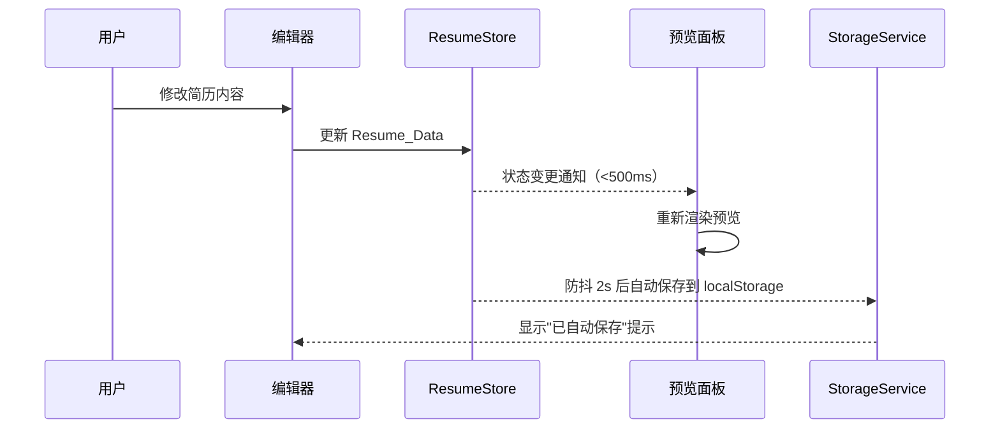

# 技术设计文档 - 简历制作应用 (Resume Builder)

## 概述

本设计文档描述了一个基于 Web 的简历制作应用的技术架构和实现方案。该应用采用 React + TypeScript 技术栈，使用 Vite 作为构建工具，Tailwind CSS 进行样式管理。应用为纯前端 SPA（单页应用），所有数据存储在浏览器 localStorage 中，无需后端服务。

核心功能包括：
- 结构化简历内容编辑（个人信息、工作经历、教育背景、技能、自定义区块）
- 多模板选择与主题颜色自定义
- 实时预览（编辑器与预览面板并排布局）
- PDF / JSON 导出与 JSON 导入
- 本地自动保存与多份简历管理
- 响应式布局与深浅主题切换

### 技术选型

| 技术 | 用途 | 选型理由 |
|------|------|----------|
| React 18 | UI 框架 | 组件化开发，生态成熟，适合复杂表单应用 |
| TypeScript | 类型系统 | 强类型保障数据模型一致性 |
| Vite | 构建工具 | 快速 HMR，开箱即用的 TypeScript 支持 |
| Tailwind CSS | 样式方案 | 原子化 CSS，快速实现简约设计风格 |
| @dnd-kit | 拖拽排序 | 轻量级 React 拖拽库，支持键盘无障碍 |
| html2canvas + jsPDF | PDF 导出 | 纯前端 PDF 生成，保持与预览一致 |
| react-colorful | 颜色选择器 | 轻量无依赖的颜色选择组件 |
| Zustand | 状态管理 | 轻量级，API 简洁，内置 localStorage 中间件 |
| fast-check | 属性测试 | JavaScript/TypeScript 属性测试库 |
| Vitest | 测试框架 | 与 Vite 深度集成，速度快 |


## 架构

### 整体架构

应用采用分层架构，将关注点分离为数据层、逻辑层和视图层：



### 数据流




## 组件与接口

### 目录结构

```
src/
├── components/
│   ├── Editor/
│   │   ├── PersonalInfoForm.tsx    # 个人信息表单
│   │   ├── ExperienceForm.tsx      # 工作经历表单
│   │   ├── EducationForm.tsx       # 教育背景表单
│   │   ├── SkillsForm.tsx          # 技能标签编辑
│   │   ├── CustomSectionForm.tsx   # 自定义区块表单
│   │   └── SortableSectionList.tsx # 可拖拽排序的区块列表
│   ├── Preview/
│   │   ├── PreviewPanel.tsx        # 预览面板容器
│   │   └── templates/              # 模板组件目录
│   │       ├── ClassicTemplate.tsx
│   │       ├── ModernTemplate.tsx
│   │       └── MinimalTemplate.tsx
│   ├── Layout/
│   │   ├── AppLayout.tsx           # 应用主布局
│   │   ├── Sidebar.tsx             # 简历列表侧边栏
│   │   └── ExportBar.tsx           # 导出工具栏
│   ├── UI/
│   │   ├── TemplateSelector.tsx    # 模板选择器
│   │   ├── ThemePicker.tsx         # 主题颜色选择器
│   │   ├── ThemeToggle.tsx         # 深浅主题切换
│   │   ├── ConfirmDialog.tsx       # 确认对话框
│   │   └── TagInput.tsx            # 标签输入组件
├── stores/
│   ├── resumeStore.ts              # 简历数据状态管理
│   └── uiStore.ts                  # UI 状态管理
├── services/
│   ├── storageService.ts           # localStorage 存储服务
│   ├── exportService.ts            # PDF/JSON 导出服务
│   ├── importService.ts            # JSON 导入服务
│   ├── validationService.ts        # 数据校验服务
│   └── templateRegistry.ts         # 模板注册表
├── hooks/
│   ├── useAutoSave.ts              # 自动保存 Hook
│   └── useDebounce.ts              # 防抖 Hook
├── types/
│   └── resume.ts                   # 类型定义
├── utils/
│   └── validators.ts               # 校验工具函数
├── App.tsx
└── main.tsx
```

### 核心接口定义

#### ResumeStore（Zustand Store）

```typescript
interface ResumeStoreState {
  // 当前编辑的简历
  currentResumeId: string | null;
  resumeData: ResumeData;

  // 所有简历列表
  resumeList: ResumeListItem[];

  // 模板与主题
  selectedTemplateId: string;
  themeColor: string;

  // 操作方法
  updatePersonalInfo: (info: Partial<PersonalInfo>) => void;
  addExperience: () => void;
  updateExperience: (id: string, data: Partial<Experience>) => void;
  removeExperience: (id: string) => void;
  reorderExperiences: (fromIndex: number, toIndex: number) => void;

  addEducation: () => void;
  updateEducation: (id: string, data: Partial<Education>) => void;
  removeEducation: (id: string) => void;
  reorderEducations: (fromIndex: number, toIndex: number) => void;

  addSkill: (name: string) => void;
  removeSkill: (id: string) => void;
  updateSkillLevel: (id: string, level: SkillLevel) => void;

  addCustomSection: () => void;
  updateCustomSection: (id: string, data: Partial<CustomSection>) => void;
  removeCustomSection: (id: string) => void;
  reorderSections: (fromIndex: number, toIndex: number) => void;

  setTemplate: (templateId: string) => void;
  setThemeColor: (color: string) => void;

  // 简历管理
  createResume: (name: string) => void;
  loadResume: (id: string) => void;
  deleteResume: (id: string) => void;
  renameResume: (id: string, name: string) => void;

  // 导入导出
  importFromJSON: (json: string) => ImportResult;
  exportToJSON: () => string;

  // 重置
  clearAll: () => void;
}
```


#### ValidationService

```typescript
interface ValidationService {
  validateEmail: (email: string) => ValidationResult;
  validatePhone: (phone: string) => ValidationResult;
  validateDateRange: (start: string, end: string) => ValidationResult;
  validateResumeData: (data: unknown) => ResumeDataValidationResult;
}

interface ValidationResult {
  valid: boolean;
  error?: string;
}

interface ResumeDataValidationResult {
  valid: boolean;
  missingFields: string[];
  errors: string[];
}
```

#### ExportService

```typescript
interface ExportService {
  exportToPDF: (element: HTMLElement) => Promise<Blob>;
  exportToJSON: (data: ResumeData) => string;
}
```

#### ImportService

```typescript
interface ImportService {
  parseJSON: (content: string) => ImportResult;
}

type ImportResult =
  | { success: true; data: ResumeData }
  | { success: false; error: 'invalid_json' | 'missing_fields'; details?: string[] };
```

#### StorageService

```typescript
interface StorageService {
  saveResume: (id: string, data: ResumeData) => void;
  loadResume: (id: string) => ResumeData | null;
  deleteResume: (id: string) => void;
  getResumeList: () => ResumeListItem[];
  saveResumeList: (list: ResumeListItem[]) => void;
  clearAll: () => void;
}
```

#### TemplateRegistry

```typescript
interface TemplateDefinition {
  id: string;
  name: string;
  thumbnail: string;
  component: React.ComponentType<TemplateProps>;
}

interface TemplateProps {
  data: ResumeData;
  themeColor: string;
}

interface TemplateRegistry {
  getAll: () => TemplateDefinition[];
  getById: (id: string) => TemplateDefinition | undefined;
  register: (template: TemplateDefinition) => void;
}
```


## 数据模型

### 核心类型定义

```typescript
// 简历完整数据结构
interface ResumeData {
  personalInfo: PersonalInfo;
  experiences: Experience[];
  educations: Education[];
  skills: Skill[];
  customSections: CustomSection[];
  sectionOrder: string[]; // Section ID 排序数组
  metadata: ResumeMetadata;
}

interface PersonalInfo {
  name: string;
  email: string;
  phone: string;
  address: string;
  website: string;
  avatar: string; // Base64 或 URL
}

interface Experience {
  id: string;
  company: string;
  position: string;
  startDate: string; // ISO 8601 格式 YYYY-MM
  endDate: string;   // ISO 8601 格式 YYYY-MM，空字符串表示"至今"
  description: string;
}

interface Education {
  id: string;
  school: string;
  degree: string;
  major: string;
  startDate: string; // ISO 8601 格式 YYYY-MM
  endDate: string;   // ISO 8601 格式 YYYY-MM
}

type SkillLevel = 'beginner' | 'intermediate' | 'advanced' | 'expert';

interface Skill {
  id: string;
  name: string;
  level: SkillLevel;
}

interface CustomSection {
  id: string;
  title: string;
  content: string; // HTML 富文本内容
}

interface ResumeMetadata {
  templateId: string;
  themeColor: string;
  createdAt: string;  // ISO 8601
  updatedAt: string;  // ISO 8601
}

// 简历列表项（用于侧边栏展示）
interface ResumeListItem {
  id: string;
  name: string;
  updatedAt: string;
}
```

### localStorage 存储结构

```
localStorage:
  ├── resume_builder_list        → JSON: ResumeListItem[]
  ├── resume_builder_data_{id}   → JSON: ResumeData
  ├── resume_builder_current_id  → string: 当前编辑的简历 ID
  └── resume_builder_theme_mode  → 'light' | 'dark'
```

### 默认空简历数据

```typescript
const DEFAULT_RESUME_DATA: ResumeData = {
  personalInfo: {
    name: '', email: '', phone: '',
    address: '', website: '', avatar: ''
  },
  experiences: [],
  educations: [],
  skills: [],
  customSections: [],
  sectionOrder: ['personalInfo', 'experiences', 'educations', 'skills'],
  metadata: {
    templateId: 'classic',
    themeColor: '#2563EB',
    createdAt: '', // 创建时填充
    updatedAt: ''  // 每次保存时更新
  }
};
```


## 正确性属性

*正确性属性是指在系统所有有效执行中都应保持为真的特征或行为——本质上是关于系统应该做什么的形式化陈述。属性是连接人类可读规范与机器可验证正确性保证之间的桥梁。*

### 属性 1：邮箱格式校验

*对于任意*不符合标准邮箱格式的字符串，`validateEmail` 应返回 `{ valid: false }`；*对于任意*符合标准邮箱格式的字符串，应返回 `{ valid: true }`。

**验证需求：需求 1.3**

### 属性 2：电话号码格式校验

*对于任意*包含除数字、`+`、`-` 以外字符的字符串，`validatePhone` 应返回 `{ valid: false }`；*对于任意*仅包含数字、`+`、`-` 的非空字符串，应返回 `{ valid: true }`。

**验证需求：需求 1.4**

### 属性 3：列表项增删不变量

*对于任意*列表类区块（工作经历、教育背景、技能、自定义区块）和任意有效的列表项数据，添加一个项后列表长度应增加 1 且该项可被检索到；删除一个已存在的项后列表长度应减少 1 且该项不再存在于列表中。

**验证需求：需求 2.1, 2.3, 2.4, 3.1, 3.3, 3.4, 4.1, 4.2, 4.3, 5.1, 5.3, 5.4**

### 属性 4：排序操作保持元素不变量

*对于任意*列表类区块和任意有效的重排序操作（交换两个合法索引位置），重排序后的列表应包含与原列表完全相同的元素集合（仅顺序不同）。

**验证需求：需求 2.5, 3.5, 5.5**


### 属性 5：日期范围校验

*对于任意*两个日期，当结束日期早于开始日期时，`validateDateRange` 应返回 `{ valid: false }`；当结束日期晚于或等于开始日期时，应返回 `{ valid: true }`。

**验证需求：需求 2.6**

### 属性 6：模板切换保持数据不变量

*对于任意* `ResumeData` 和任意模板 ID，执行模板切换操作后，除 `metadata.templateId` 外的所有简历数据字段应保持不变。

**验证需求：需求 6.3**

### 属性 7：JSON 导出/导入往返一致性

*对于任意*有效的 `ResumeData` 对象，将其通过 `exportToJSON` 序列化为 JSON 字符串后，再通过 `parseJSON` 反序列化，应产生与原始对象深度相等的 `ResumeData`。

**验证需求：需求 9.5, 9.6, 10.1**

### 属性 8：导入无效数据的错误处理

*对于任意*非有效 JSON 的字符串，`parseJSON` 应返回 `{ success: false, error: 'invalid_json' }`；*对于任意*有效 JSON 但缺少必要字段的对象，应返回 `{ success: false, error: 'missing_fields' }` 并列出缺失字段。

**验证需求：需求 10.2, 10.3**

### 属性 9：本地存储往返一致性

*对于任意*有效的 `ResumeData` 对象和任意简历 ID，通过 `saveResume` 保存后再通过 `loadResume` 加载，应产生与原始对象深度相等的 `ResumeData`。

**验证需求：需求 11.1, 11.2**

### 属性 10：多简历独立性

*对于任意*数量的简历，每份简历的创建、修改和删除操作不应影响其他简历的数据。具体而言：创建一份新简历后简历列表长度增加 1；删除一份简历后该简历不可再被加载，且其他简历数据保持不变。

**验证需求：需求 12.1, 12.3, 12.4**


## 错误处理

### 输入校验错误

| 场景 | 处理方式 |
|------|----------|
| 邮箱格式无效 | 字段下方显示红色错误提示文字，不阻止其他操作 |
| 电话格式无效 | 字段下方显示红色错误提示文字，不阻止其他操作 |
| 日期范围无效（结束 < 开始） | 日期字段下方显示错误提示 |
| 技能名称为空 | 忽略输入，不添加空标签 |

### 导入错误

| 场景 | 处理方式 |
|------|----------|
| 文件非 JSON 格式 | 显示 Toast 提示"文件格式无效" |
| JSON 缺少必要字段 | 显示 Toast 提示"简历数据不完整"并列出缺失字段 |
| 文件读取失败 | 显示 Toast 提示"文件读取失败，请重试" |

### 存储错误

| 场景 | 处理方式 |
|------|----------|
| localStorage 已满 | 显示 Toast 提示"存储空间不足，请清理部分简历数据" |
| localStorage 不可用 | 应用正常运行但禁用自动保存，显示提示"自动保存不可用" |

### PDF 导出错误

| 场景 | 处理方式 |
|------|----------|
| 渲染失败 | 显示 Toast 提示"PDF 生成失败，请重试" |
| 内容为空 | 禁用导出按钮，提示"请先填写简历内容" |


## 测试策略

### 双重测试方法

本项目采用单元测试与属性测试相结合的方式，确保全面的测试覆盖：

- **单元测试（Vitest）**：验证具体示例、边界情况和错误条件
- **属性测试（fast-check + Vitest）**：验证跨所有输入的通用属性

两者互补：单元测试捕获具体 bug，属性测试验证通用正确性。

### 属性测试配置

- 测试库：**fast-check**（JavaScript/TypeScript 属性测试库）
- 测试框架：**Vitest**
- 每个属性测试最少运行 **100 次迭代**
- 每个属性测试必须通过注释引用设计文档中的属性编号
- 标签格式：`Feature: resume-builder, Property {number}: {property_text}`
- 每个正确性属性由**单个**属性测试实现

### 单元测试范围

单元测试聚焦于：
- 具体示例验证（如模板数量 ≥ 3、预设颜色 ≥ 6）
- 组件集成点测试
- 边界情况（空数据、超长文本、特殊字符）
- 错误条件（无效文件、存储满、网络异常）

### 属性测试范围

每个正确性属性对应一个属性测试：

| 属性 | 测试文件 | 说明 |
|------|----------|------|
| 属性 1：邮箱格式校验 | `validators.property.test.ts` | 生成随机字符串测试邮箱校验 |
| 属性 2：电话号码格式校验 | `validators.property.test.ts` | 生成随机字符串测试电话校验 |
| 属性 3：列表项增删不变量 | `resumeStore.property.test.ts` | 生成随机列表项测试 CRUD |
| 属性 4：排序操作保持元素 | `resumeStore.property.test.ts` | 生成随机排序操作测试元素守恒 |
| 属性 5：日期范围校验 | `validators.property.test.ts` | 生成随机日期对测试范围校验 |
| 属性 6：模板切换保持数据 | `resumeStore.property.test.ts` | 生成随机数据和模板测试不变量 |
| 属性 7：JSON 往返一致性 | `exportImport.property.test.ts` | 生成随机 ResumeData 测试序列化往返 |
| 属性 8：导入无效数据错误 | `importService.property.test.ts` | 生成随机无效输入测试错误处理 |
| 属性 9：本地存储往返一致性 | `storageService.property.test.ts` | 生成随机 ResumeData 测试存储往返 |
| 属性 10：多简历独立性 | `resumeStore.property.test.ts` | 生成随机简历操作序列测试独立性 |
