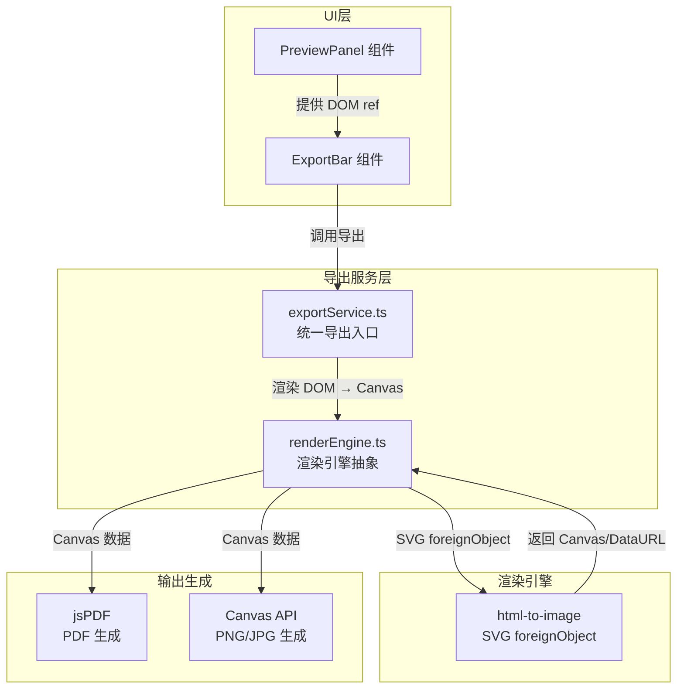
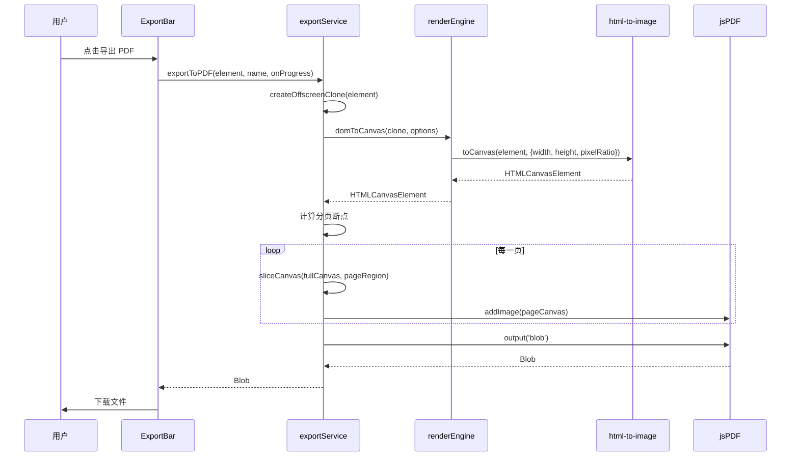

# 设计文档：简历导出功能重构 (export-refactor)

## 概述

当前 FlashResume 的导出功能基于 html2canvas + jsPDF 方案，存在以下核心问题：

1. **样式保真度不足**：html2canvas 通过 JS 重新绘制 DOM 到 Canvas，无法完美还原 CSS 特性（如 oklch 颜色、复杂布局、自定义字体、Tailwind 工具类等），导致导出结果与预览存在差异。
2. **导出速度慢**：html2canvas 需要遍历整个 DOM 树并逐元素绘制，对于包含 24 个模板的复杂简历，渲染耗时显著。
3. **维护成本高**：项目已打了 html2canvas 的 oklch 补丁（`html2canvas-patched.ts`），且捆绑了完整的 ESM 源码（`html2canvas.esm.js`），增加了包体积和维护负担。

本次重构采用 **html-to-image（基于原生 SVG foreignObject）** 替代 html2canvas 作为核心渲染引擎，结合 jsPDF 生成 PDF。该方案利用浏览器原生渲染能力，天然保证样式一致性，同时显著提升导出速度。

## 架构



## 主要导出流程



## 组件与接口

### 组件 1：renderEngine.ts（渲染引擎抽象层）

**职责**：封装 html-to-image 调用，提供统一的 DOM → Canvas 转换接口。

```typescript
interface RenderOptions {
  width: number;
  height: number;
  pixelRatio: number;
  backgroundColor: string;
  /** 可选：自定义样式过滤器，用于导出前清理 dark mode 等样式 */
  filter?: (node: HTMLElement) => boolean;
}

interface RenderEngine {
  /** 将 DOM 元素渲染为 Canvas */
  domToCanvas(element: HTMLElement, options: RenderOptions): Promise<HTMLCanvasElement>;
  /** 将 DOM 元素渲染为 DataURL（用于快速图片导出） */
  domToDataURL(element: HTMLElement, options: RenderOptions, format?: 'png' | 'jpeg', quality?: number): Promise<string>;
}
```

**设计决策**：
- 抽象层使未来更换渲染引擎（如回退到 html2canvas 或升级到其他方案）无需修改上层代码
- `filter` 回调用于在渲染前过滤掉不需要的 DOM 节点（如暗色模式类名）

### 组件 2：exportService.ts（重构后的导出服务）

**职责**：协调渲染引擎和输出生成，处理分页逻辑、进度回调。

```typescript
interface ExportOptions {
  /** 导出缩放倍率，默认 2 */
  pixelRatio?: number;
  /** 进度回调 */
  onProgress?: ProgressCallback;
}

// 公开 API（保持与现有接口兼容）
function exportToPDF(element: HTMLElement, personName?: string, onProgress?: ProgressCallback): Promise<Blob>;
function exportToPNG(element: HTMLElement, onProgress?: ProgressCallback): Promise<Blob>;
function exportToJPG(element: HTMLElement, onProgress?: ProgressCallback): Promise<Blob>;
function exportToJSON(data: ResumeData): string;
function downloadFile(blob: Blob, filename: string): void;
```

**设计决策**：
- 保持公开 API 签名不变，ExportBar 组件无需修改
- 内部实现从 html2canvas 切换到 renderEngine

### 组件 3：ExportBar.tsx（无需修改）

现有 ExportBar 组件通过 `exportService` 的公开 API 调用导出功能，接口保持不变，无需修改。

## 数据模型

### A4 页面常量

```typescript
/** A4 尺寸常量 */
const A4 = {
  WIDTH_PT: 595.28,    // PDF 点单位宽度
  HEIGHT_PT: 841.89,   // PDF 点单位高度
  WIDTH_PX: 794,       // 像素宽度 (~210mm @ 96dpi)
  HEIGHT_PX: 1123,     // 像素高度 (~297mm @ 96dpi)
  MARGIN_PX: 40,       // 页面边距（像素）
} as const;

/** 导出配置 */
interface ExportConfig {
  pixelRatio: number;           // 渲染缩放倍率
  backgroundColor: string;      // 背景色
  pageContentHeight: number;    // 每页可用内容高度
  firstPageHeight: number;      // 首页可用内容高度
}
```

### 分页断点模型

```typescript
interface PageBreak {
  /** 页面起始 Y 坐标（像素） */
  top: number;
  /** 页面内容高度（像素） */
  contentHeight: number;
}
```

## 算法伪代码

### 核心渲染算法：DOM → Canvas

```typescript
async function domToCanvas(element: HTMLElement, options: RenderOptions): Promise<HTMLCanvasElement> {
  // 前置条件：element 非空且已挂载到 DOM
  // 后置条件：返回的 Canvas 宽高 = options.width * pixelRatio × options.height * pixelRatio

  const canvas = await toCanvas(element, {
    width: options.width,
    height: options.height,
    pixelRatio: options.pixelRatio,
    backgroundColor: options.backgroundColor,
    filter: options.filter,
    // 跳过非必要节点以提升速度
    skipAutoScale: true,
    // 内联所有计算样式，确保 foreignObject 中样式完整
    includeQueryParams: false,
  });

  return canvas;
}
```

**前置条件**：
- `element` 已挂载到 DOM 且可见（或在 offscreen 容器中）
- `options.width > 0 && options.height > 0`
- `options.pixelRatio >= 1`

**后置条件**：
- 返回的 Canvas 像素尺寸 = `(width * pixelRatio, height * pixelRatio)`
- Canvas 内容与浏览器渲染结果视觉一致

### PDF 导出算法

```typescript
async function exportToPDF(
  element: HTMLElement,
  personName?: string,
  onProgress?: ProgressCallback
): Promise<Blob> {
  // 步骤 1：创建离屏克隆（清理暗色模式样式）
  const { offscreen, clone } = createOffscreenClone(element);
  
  try {
    onProgress?.(5);
    
    // 步骤 2：等待浏览器完成布局
    await waitForLayout();
    onProgress?.(10);
    
    // 步骤 3：获取内容总高度
    const totalHeight = clone.scrollHeight;
    onProgress?.(15);
    
    // 步骤 4：使用 html-to-image 渲染完整内容为 Canvas
    const fullCanvas = await renderEngine.domToCanvas(clone, {
      width: A4.WIDTH_PX,
      height: totalHeight,
      pixelRatio: 2,
      backgroundColor: '#ffffff',
    });
    onProgress?.(60);
    
    // 步骤 5：单页快速路径
    if (totalHeight <= A4.HEIGHT_PX) {
      return buildSinglePagePDF(fullCanvas, personName);
    }
    
    // 步骤 6：计算分页断点
    const breakpoints = collectBreakpoints(clone);
    const pageBreaks = computePageBreaks(breakpoints, totalHeight);
    onProgress?.(65);
    
    // 步骤 7：逐页切片并写入 PDF
    const pdf = new jsPDF({ orientation: 'portrait', unit: 'pt', format: 'a4' });
    for (let i = 0; i < pageBreaks.length; i++) {
      if (i > 0) pdf.addPage();
      
      const pageTop = pageBreaks[i];
      const pageBottom = i + 1 < pageBreaks.length ? pageBreaks[i + 1] : totalHeight;
      const sliceHeight = pageBottom - pageTop;
      
      const pageCanvas = sliceCanvas(fullCanvas, 0, pageTop * 2, A4.WIDTH_PX * 2, sliceHeight * 2);
      const drawHeight = (sliceHeight / A4.WIDTH_PX) * A4.WIDTH_PT;
      
      pdf.addImage(pageCanvas.toDataURL('image/png'), 'PNG', 0, i === 0 ? 0 : A4.MARGIN_PX, A4.WIDTH_PT, drawHeight);
      drawPageFooter(pdf, personName || '', i + 1, pageBreaks.length);
      
      onProgress?.(65 + ((i + 1) / pageBreaks.length) * 25);
      await yieldToMain();
    }
    
    onProgress?.(92);
    return pdf.output('blob');
  } finally {
    document.body.removeChild(offscreen);
  }
}
```

**前置条件**：
- `element` 是有效的简历预览 DOM 节点
- `element` 包含完整的简历模板渲染内容

**后置条件**：
- 返回有效的 PDF Blob
- PDF 页面尺寸为标准 A4
- 每页底部包含姓名和页码
- 导出样式与预览视觉一致

**循环不变量**：
- 在分页循环中，所有已处理的页面都已正确写入 PDF
- `pageBreaks[i]` 始终 < `pageBreaks[i+1]`（严格递增）

### 图片导出算法

```typescript
async function exportToImageBlob(
  element: HTMLElement,
  format: 'png' | 'jpeg',
  onProgress?: ProgressCallback
): Promise<Blob> {
  const { offscreen, clone } = createOffscreenClone(element);
  
  try {
    onProgress?.(5);
    await waitForLayout();
    onProgress?.(10);
    
    const height = Math.max(clone.scrollHeight, A4.HEIGHT_PX);
    onProgress?.(15);
    
    // 使用 html-to-image 直接生成 DataURL（比 toCanvas + toBlob 更快）
    const dataUrl = await renderEngine.domToDataURL(clone, {
      width: A4.WIDTH_PX,
      height,
      pixelRatio: 2,
      backgroundColor: '#ffffff',
    }, format, format === 'jpeg' ? 0.92 : undefined);
    onProgress?.(80);
    
    // DataURL → Blob
    const blob = dataURLToBlob(dataUrl);
    onProgress?.(95);
    
    return blob;
  } finally {
    document.body.removeChild(offscreen);
  }
}
```

**前置条件**：
- `element` 是有效的简历预览 DOM 节点
- `format` 为 `'png'` 或 `'jpeg'`

**后置条件**：
- 返回有效的图片 Blob
- 图片宽度 = `A4.WIDTH_PX * pixelRatio`
- 图片内容与预览视觉一致

## 关键函数与形式化规格

### domToCanvas()

```typescript
function domToCanvas(element: HTMLElement, options: RenderOptions): Promise<HTMLCanvasElement>
```

**前置条件**：
- `element !== null && element.isConnected`
- `options.width > 0 && options.height > 0`
- `options.pixelRatio >= 1`

**后置条件**：
- `result.width === options.width * options.pixelRatio`
- `result.height === options.height * options.pixelRatio`
- Canvas 内容与浏览器原生渲染视觉一致

### createOffscreenClone()

```typescript
function createOffscreenClone(element: HTMLElement): { offscreen: HTMLDivElement; clone: HTMLElement }
```

**前置条件**：
- `element !== null`

**后置条件**：
- `offscreen` 已挂载到 `document.body`
- `clone` 是 `element` 的深拷贝
- `clone` 不包含 `dark:` 前缀的 CSS 类名
- `clone.style.width === A4.WIDTH_PX + 'px'`
- `clone.style.background === 'white'`

### collectBreakpoints()

```typescript
function collectBreakpoints(root: HTMLElement): number[]
```

**前置条件**：
- `root` 已挂载到 DOM 且有有效的 `getBoundingClientRect()`

**后置条件**：
- 返回值已排序（升序）
- 返回值包含 `0`（起始点）
- 所有值 >= 0
- 所有值 <= `root.scrollHeight`

**循环不变量**：
- 遍历深度不超过 2 层
- 每个子元素的 top 和 bottom 坐标都被收集

### computePageBreaks()

```typescript
function computePageBreaks(breakpoints: number[], totalHeight: number): number[]
```

**前置条件**：
- `breakpoints` 已排序且包含 `0`
- `totalHeight > 0`

**后置条件**：
- 返回值第一个元素为 `0`
- 返回值严格递增
- 相邻断点间距不超过页面可用内容高度
- 最后一个断点 + 页面高度 >= `totalHeight`

## 示例用法

```typescript
// 示例 1：PDF 导出（与现有 API 完全兼容）
const blob = await exportToPDF(previewRef.current, '张三', (progress) => {
  console.log(`导出进度: ${progress}%`);
});
downloadFile(blob, 'resume.pdf');

// 示例 2：PNG 导出
const pngBlob = await exportToPNG(previewRef.current, (progress) => {
  setProgress(progress);
});
downloadFile(pngBlob, 'resume.png');

// 示例 3：直接使用渲染引擎（高级用法）
import { renderEngine } from './renderEngine';

const canvas = await renderEngine.domToCanvas(element, {
  width: 794,
  height: 1123,
  pixelRatio: 2,
  backgroundColor: '#ffffff',
});
```

## 正确性属性

*属性（Property）是指在系统所有有效执行中都应成立的特征或行为——本质上是对系统应做什么的形式化陈述。属性是人类可读规格说明与机器可验证正确性保证之间的桥梁。*

### Property 1: Canvas 尺寸不变量

*For any* valid RenderOptions with positive width, height, and pixelRatio (>= 1), calling `domToCanvas` should return a Canvas whose pixel width equals `width * pixelRatio` and pixel height equals `height * pixelRatio`.

**Validates: Requirement 1.3**

### Property 2: 暗色模式类名完全清除

*For any* DOM element tree containing CSS class names, after applying `stripDarkClasses`, no element in the tree should have any class name starting with `dark:` or equal to `dark`.

**Validates: Requirement 2.3**

### Property 3: 进度回调单调递增且有界

*For any* export operation with an onProgress callback, the sequence of reported progress values should be strictly increasing and every value should be within the range [0, 100].

**Validates: Requirements 5.1, 5.2**

### Property 4: 分页断点结构有效性

*For any* sorted breakpoint array containing 0 and any positive totalHeight, `computePageBreaks` should return an array whose first element is 0 and whose elements are strictly increasing.

**Validates: Requirements 6.2, 6.3**

### Property 5: 分页断点最大间距约束

*For any* sorted breakpoint array and positive totalHeight, the distance between any two adjacent page breaks returned by `computePageBreaks` should not exceed the page content height.

**Validates: Requirement 6.4**

### Property 6: 分页断点覆盖完整内容

*For any* sorted breakpoint array and positive totalHeight, the last page break returned by `computePageBreaks` plus the page content height should be greater than or equal to totalHeight.

**Validates: Requirement 6.5**

### Property 7: JSON 序列化往返一致性

*For any* valid ResumeData object, calling `exportToJSON` and then `JSON.parse` on the result should produce an object deeply equal to the original ResumeData.

**Validates: Requirement 8.1**

## 错误处理

### 场景 1：html-to-image 渲染失败

**条件**：SVG foreignObject 渲染异常（如跨域资源、不支持的 CSS 特性）
**响应**：捕获异常，向用户显示错误 toast
**恢复**：可选的降级策略 — 回退到 html2canvas 作为备用渲染引擎

### 场景 2：Canvas 内存不足

**条件**：超长简历（多页）导致 Canvas 尺寸过大
**响应**：检测内容高度，若超过阈值则分段渲染
**恢复**：逐页渲染而非一次性渲染全部内容

### 场景 3：PDF 生成失败

**条件**：jsPDF 写入异常
**响应**：捕获异常，通过 onProgress 回调通知失败
**恢复**：清理离屏 DOM 节点，释放 Canvas 资源

### 场景 4：跨域图片资源

**条件**：简历中包含外部 URL 的头像图片
**响应**：html-to-image 的 `fetchRequestInit` 选项配置 CORS
**恢复**：若 CORS 失败，跳过该图片或使用占位符

## 测试策略

### 单元测试

- `computePageBreaks()` 的边界条件测试（单页、多页、空内容）
- `collectBreakpoints()` 的 DOM 结构测试
- `createOffscreenClone()` 的暗色模式清理测试
- `sliceCanvas()` 的裁切正确性测试
- `dataURLToBlob()` 的格式转换测试

### 属性测试

**属性测试库**：fast-check（已在 devDependencies 中）

- 分页断点的单调递增性
- 分页断点覆盖完整内容高度
- 进度回调值的单调递增性
- Canvas 尺寸与配置参数的一致性

### 集成测试

- 端到端导出流程测试（PDF/PNG/JPG）
- 多模板导出一致性测试
- 导出进度回调完整性测试

## 性能考量

### 速度优化分析

| 环节 | html2canvas (当前) | html-to-image (重构后) | 提升原因 |
|------|-------------------|----------------------|---------|
| DOM 解析 | JS 遍历 + 重绘 | 浏览器原生序列化 | 原生 API 比 JS 模拟快 |
| 样式计算 | getComputedStyle 逐元素 | 浏览器内联 | 批量处理 vs 逐个处理 |
| 渲染 | Canvas 2D 逐元素绘制 | SVG foreignObject | 浏览器原生渲染管线 |
| 预估耗时 | 2-5 秒 | 0.5-1.5 秒 | 约 2-3x 提升 |

### 包体积优化

- 移除 `html2canvas.esm.js`（~200KB 未压缩）和 `html2canvas-patched.ts`
- html-to-image 仅 ~10KB（gzip 后 ~3KB）
- 净减少约 190KB+ 包体积

### 内存优化

- 对超长简历采用分段渲染策略，避免创建超大 Canvas
- 及时释放离屏 DOM 和中间 Canvas 资源

## 安全考量

- 导出过程完全在客户端执行，不涉及服务端通信
- 头像图片的 CORS 处理需确保不泄露用户凭证
- 离屏 DOM 节点在 finally 块中清理，防止内存泄漏

## 依赖

### 保留依赖
- `jspdf` ^4.2.0 — PDF 生成
- `html-to-image` ^1.11.13 — 已在 package.json 中但未使用，重构后启用

### 移除依赖
- `html2canvas` ^1.4.1 — 从 package.json 移除
- `src/lib/html2canvas.esm.js` — 删除本地打补丁的源码
- `src/lib/html2canvas-patched.ts` — 删除补丁封装文件

### 开源社区方案对比

| 方案 | 原理 | 样式保真度 | 速度 | 包体积 | 选择理由 |
|------|------|-----------|------|--------|---------|
| html2canvas | JS 重绘 DOM | ⭐⭐⭐ | ⭐⭐ | ~200KB | 当前方案，CSS 兼容性差 |
| **html-to-image** | **SVG foreignObject** | **⭐⭐⭐⭐⭐** | **⭐⭐⭐⭐** | **~10KB** | **✅ 选用：原生渲染，高保真** |
| dom-to-image | SVG foreignObject | ⭐⭐⭐⭐ | ⭐⭐⭐ | ~15KB | html-to-image 的前身，已停维 |
| Puppeteer/Playwright | 无头浏览器 | ⭐⭐⭐⭐⭐ | ⭐⭐ | 需服务端 | 需后端，不适合纯前端应用 |
| @react-pdf/renderer | React → PDF | ⭐⭐⭐ | ⭐⭐⭐⭐ | ~150KB | 需重写模板，改动量大 |
