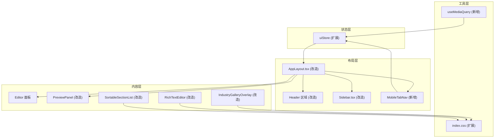

# 技术设计文档：移动端响应式适配

## 概述

本设计文档描述 FlashResume 简历编辑器的移动端响应式适配方案。当前应用基于 React 19 + TypeScript + Tailwind CSS 4 + Zustand 构建，采用桌面端优先的左右分栏布局（Sidebar + Editor + Preview）。本次适配将在不破坏桌面端体验的前提下，通过 CSS 媒体查询、Zustand 状态扩展和新增移动端专用组件，实现三个断点（Mobile < 768px、Tablet 768-1023px、Desktop ≥ 1024px）的完整响应式体验。

核心设计原则：
- **CSS 优先**：尽可能通过 Tailwind 响应式工具类（`max-lg:`、`max-md:`）和 CSS 媒体查询实现布局切换，减少 JS 逻辑
- **渐进增强**：移动端隐藏非核心 UI（如拖拽分隔条），保留所有功能可达性
- **最小侵入**：复用现有组件结构，通过条件样式和少量新组件完成适配

## 架构

### 整体架构图



### 断点策略

| 断点 | 宽度范围 | Tailwind 前缀 | 布局模式 |
|------|----------|---------------|----------|
| Mobile | < 768px | 默认 / `md:` | 全屏单面板 + 底部 Tab 切换 |
| Tablet | 768px - 1023px | `md:` / `lg:` | 左右分栏（55:45） |
| Desktop | ≥ 1024px | `lg:` | 左右分栏（可拖拽调整） |

### 改造范围

| 文件 | 改造类型 | 说明 |
|------|----------|------|
| `index.html` | 修改 | 更新 viewport meta 标签 |
| `src/index.css` | 扩展 | 添加安全区域、触控目标等全局样式 |
| `src/hooks/useMediaQuery.ts` | 新增 | 响应式断点检测 Hook |
| `src/stores/uiStore.ts` | 扩展 | 添加 `activeTab` 状态 |
| `src/components/Layout/AppLayout.tsx` | 改造 | 移动端布局切换逻辑 |
| `src/components/Layout/Sidebar.tsx` | 改造 | 移动端抽屉行为优化 |
| `src/components/Layout/ExportBar.tsx` | 改造 | 触控目标尺寸、菜单定位 |
| `src/components/Layout/MobileTabNav.tsx` | 新增 | 底部标签页导航组件 |
| `src/components/Preview/PreviewPanel.tsx` | 改造 | 移动端缩放、触控手势 |
| `src/components/UI/RichTextEditor.tsx` | 改造 | 工具栏触控适配 |
| `src/components/Editor/SortableSectionList.tsx` | 改造 | 触控拖拽配置 |
| `src/components/Gallery/IndustryGalleryOverlay.tsx` | 改造 | 移动端布局适配 |
| `src/components/Gallery/FilterPanel.tsx` | 改造 | 滚动条隐藏 |


## 组件与接口

### 1. `useMediaQuery` Hook（新增）

```typescript
// src/hooks/useMediaQuery.ts
export function useMediaQuery(query: string): boolean;
export function useIsMobile(): boolean;  // < 768px
export function useIsTablet(): boolean;  // 768px - 1023px
```

基于 `window.matchMedia` API 实现，返回响应式布尔值。组件通过此 Hook 判断当前断点，决定渲染逻辑。

### 2. `MobileTabNav` 组件（新增）

```typescript
// src/components/Layout/MobileTabNav.tsx
interface MobileTabNavProps {
  activeTab: 'editor' | 'preview';
  onTabChange: (tab: 'editor' | 'preview') => void;
}

export default function MobileTabNav({ activeTab, onTabChange }: MobileTabNavProps): JSX.Element;
```

固定在屏幕底部的标签页导航，仅在 Mobile 断点下渲染。包含"编辑"和"预览"两个标签，通过 `uiStore.activeTab` 控制当前显示的面板。需适配 iOS 安全区域（`env(safe-area-inset-bottom)`）。

### 3. `uiStore` 扩展

```typescript
// 新增状态和方法
interface UIStoreState {
  // ... 现有字段
  activeTab: 'editor' | 'preview';
  setActiveTab: (tab: 'editor' | 'preview') => void;
}
```

### 4. `AppLayout` 改造

核心改造点：
- Mobile 断点下：根据 `activeTab` 条件渲染 Editor 或 Preview，隐藏拖拽分隔条，底部渲染 `MobileTabNav`
- Tablet 断点下：保持左右分栏，默认 `editorWidthPct` 设为 55%，隐藏拖拽分隔条
- Desktop 断点下：保持现有行为不变
- Header 区域：移动端缩短标题文字，确保按钮触控目标 ≥ 44x44px
- Toast 通知：移动端改为顶部居中显示

### 5. `PreviewPanel` 改造

- 移动端默认缩放比例：`Math.floor(screenWidth / 794 * 100)`（794px = A4 宽度）
- 支持双指缩放手势（touch events）
- 缩放控制栏移动端居中显示在底部，按钮尺寸 ≥ 44x44px
- 缩放控制栏需避开 `MobileTabNav` 的遮挡

### 6. `Sidebar` 改造

现有实现已包含移动端抽屉模式（`fixed` 定位 + 遮罩层 + 滑动动画），需补充：
- 选择简历后自动关闭（现有 `handleSelect` 已调用 `onClose()`，已满足）
- 确保所有触控目标 ≥ 44x44px（现有实现已使用 `min-h-[44px]`，大部分已满足）

### 7. `RichTextEditor` 改造

- 工具栏按钮移动端尺寸从 `w-7 h-7` 增大到 `min-w-[44px] min-h-[44px]`
- 编辑区域移动端最小高度从 80px 增大到 120px
- 处理虚拟键盘弹出时的滚动：使用 `visualViewport` API 或 `scrollIntoView`

### 8. `SortableSectionList` 改造

- 添加 `TouchSensor` 到 `useSensors` 配置
- 设置触控激活距离阈值为 8px（现有 `PointerSensor` 已配置 `distance: 8`，`TouchSensor` 需同样配置）
- 拖拽手柄已满足 44x44px 最小尺寸

### 9. `IndustryGalleryOverlay` 改造

- 移动端模板网格切换为单列布局
- 平板端切换为两列布局
- 内边距从 24px 缩减为 16px
- 关闭按钮和模板选择按钮确保 ≥ 44x44px

### 10. `FilterPanel` 改造

- 添加 CSS 隐藏滚动条（`scrollbar-width: none` + `::-webkit-scrollbar { display: none }`）


## 数据模型

### uiStore 状态扩展

```typescript
// 新增字段
{
  activeTab: 'editor' | 'preview',  // 默认 'editor'
  setActiveTab: (tab: 'editor' | 'preview') => void,
}
```

无需新增持久化存储。`activeTab` 为纯运行时状态，页面刷新后重置为 `'editor'`。

### CSS 自定义属性扩展

```css
/* src/index.css 新增 */
:root {
  --safe-area-top: env(safe-area-inset-top, 0px);
  --safe-area-bottom: env(safe-area-inset-bottom, 0px);
  --safe-area-left: env(safe-area-inset-left, 0px);
  --safe-area-right: env(safe-area-inset-right, 0px);
  --mobile-tab-height: 56px;  /* MobileTabNav 高度 */
}
```

### 断点常量

```typescript
// src/hooks/useMediaQuery.ts
export const BREAKPOINTS = {
  mobile: 768,   // < 768px
  tablet: 1024,  // 768px - 1023px
  desktop: 1024, // ≥ 1024px
} as const;
```

### 视口配置

```html
<!-- index.html -->
<meta name="viewport" content="width=device-width, initial-scale=1.0, maximum-scale=1.0, user-scalable=no, viewport-fit=cover" />
```

`viewport-fit=cover` 启用安全区域支持，`maximum-scale=1.0, user-scalable=no` 禁止双指缩放页面（应用内预览面板有独立的缩放手势）。


## 正确性属性

*属性（Property）是指在系统所有有效执行中都应成立的特征或行为——本质上是对系统应做什么的形式化陈述。属性是人类可读规格说明与机器可验证正确性保证之间的桥梁。*

### Property 1: 触控目标最小尺寸

*For any* 可交互元素（按钮、链接、拖拽手柄等），其渲染后的最小宽度和最小高度均应 ≥ 44px。此属性覆盖 Header、Sidebar、Editor、RichTextEditor、PreviewPanel、Gallery、Toast 中的所有触控目标。

**Validates: Requirements 3.3, 4.4, 5.4, 6.1, 7.3, 8.3, 9.4, 10.2**

### Property 2: Tab 切换面板互斥显示

*For any* `activeTab` 值（`'editor'` 或 `'preview'`），在 Mobile 视口下，当 `activeTab` 为某个值时，对应面板应可见，另一个面板应不可见。即 Editor 和 Preview 面板在移动端始终互斥显示。

**Validates: Requirements 2.3, 2.4**

### Property 3: 移动端单面板布局

*For any* 视口宽度 < 768px，应用应仅显示一个内容面板（Editor 或 Preview），不应同时显示两个面板的并排布局。

**Validates: Requirements 2.1**

### Property 4: 侧边栏选择后自动关闭

*For any* 简历列表中的简历项，当用户在 Sidebar 中选择该简历后，Sidebar 应自动关闭（`open` 状态变为 `false`）。

**Validates: Requirements 4.3**

### Property 5: 文本输入框字体大小

*For any* Editor 面板中的文本输入框（`input[type="text"]`、`input[type="email"]`、`input[type="tel"]`、`input[type="url"]`），其 `font-size` 应 ≥ 16px，以防止 iOS Safari 自动缩放。

**Validates: Requirements 5.2**

### Property 6: 预览面板移动端默认缩放计算

*For any* 屏幕宽度 `w`（其中 `w < 768`），PreviewPanel 的默认缩放比例应等于 `Math.floor(w / 794 * 100)`，其中 794 是 A4 纸张的像素宽度。

**Validates: Requirements 7.1**


## 错误处理

### 视口检测降级
- 若 `window.matchMedia` 不可用（极少数旧浏览器），`useMediaQuery` Hook 返回 `false`，应用回退到桌面端布局
- `useIsMobile()` 和 `useIsTablet()` 在 SSR 环境下默认返回 `false`

### 安全区域降级
- `env(safe-area-inset-*)` 在不支持的浏览器中回退到 `0px`（通过 CSS `env()` 的第二个参数实现）

### 触控事件降级
- `TouchSensor` 在不支持触控的设备上不会激活，`PointerSensor` 作为通用后备
- 双指缩放手势在不支持 touch events 的设备上不生效，用户仍可使用按钮缩放

### 虚拟键盘处理
- 使用 `visualViewport` API 检测键盘弹出，若 API 不可用则使用 `window.innerHeight` 变化检测作为后备
- 键盘弹出时调用 `scrollIntoView({ block: 'nearest' })` 确保当前编辑区域可见

## 测试策略

### 测试框架

- **单元测试**: Vitest + React Testing Library（项目已配置）
- **属性测试**: fast-check（项目已安装 `fast-check@^4.6.0`）

### 属性测试

每个正确性属性对应一个属性测试，最少运行 100 次迭代。

| 属性 | 测试文件 | 说明 |
|------|----------|------|
| Property 1 | `src/components/__tests__/touch-targets.property.test.tsx` | 渲染各组件，检查所有交互元素的 min-width/min-height |
| Property 2 | `src/components/Layout/__tests__/MobileTabNav.property.test.tsx` | 随机生成 activeTab 值，验证面板互斥 |
| Property 3 | `src/components/Layout/__tests__/AppLayout.mobile.property.test.tsx` | 随机生成 < 768px 的视口宽度，验证单面板显示 |
| Property 4 | `src/components/Layout/__tests__/Sidebar.property.test.tsx` | 随机生成简历列表，选择任意简历后验证 sidebar 关闭 |
| Property 5 | `src/components/Editor/__tests__/font-size.property.test.tsx` | 渲染 Editor 表单，检查所有 text input 的 font-size |
| Property 6 | `src/components/Preview/__tests__/PreviewPanel.zoom.property.test.tsx` | 随机生成移动端屏幕宽度，验证缩放公式 |

属性测试标签格式：
```
// Feature: mobile-responsive-adaptation, Property 1: 触控目标最小尺寸
// Feature: mobile-responsive-adaptation, Property 2: Tab 切换面板互斥显示
// ...
```

每个正确性属性必须由单个属性测试实现。

### 单元测试

单元测试覆盖属性测试无法覆盖的具体示例和边界情况：

| 测试场景 | 测试文件 | 验收标准 |
|----------|----------|----------|
| viewport meta 标签包含正确属性 | `src/__tests__/viewport.test.ts` | 1.1, 1.3 |
| 移动端显示 MobileTabNav | `src/components/Layout/__tests__/MobileTabNav.test.tsx` | 2.2 |
| 移动端隐藏拖拽分隔条 | `src/components/Layout/__tests__/AppLayout.test.tsx` | 2.5 |
| 平板端编辑面板宽度 55% | `src/components/Layout/__tests__/AppLayout.test.tsx` | 2.6 |
| 移动端隐藏标题文字 | `src/components/Layout/__tests__/AppLayout.test.tsx` | 3.2 |
| Sidebar 默认隐藏 + 汉堡菜单触发 | `src/components/Layout/__tests__/Sidebar.test.tsx` | 4.1 |
| 点击遮罩层关闭 Sidebar | `src/components/Layout/__tests__/Sidebar.test.tsx` | 4.2 |
| 编辑面板底部预留 Tab 高度内边距 | `src/components/Layout/__tests__/AppLayout.test.tsx` | 5.5 |
| RichTextEditor 移动端最小高度 120px | `src/components/UI/__tests__/RichTextEditor.test.tsx` | 6.2 |
| DnD TouchSensor 配置 | `src/components/Editor/__tests__/SortableSectionList.test.tsx` | 8.1, 8.4 |
| Gallery 移动端内边距 16px | `src/components/Gallery/__tests__/IndustryGalleryOverlay.test.tsx` | 9.5 |
| Toast 移动端顶部居中 | `src/components/Layout/__tests__/AppLayout.test.tsx` | 10.1 |
| Toast 移动端宽度适配 | `src/components/Layout/__tests__/AppLayout.test.tsx` | 10.3 |

### 测试配置要求

- 属性测试每个 property 最少 100 次迭代（`fc.assert(property, { numRuns: 100 })`）
- 每个属性测试必须包含注释引用设计文档中的属性编号
- 单元测试聚焦具体示例和边界情况，避免与属性测试重复覆盖
