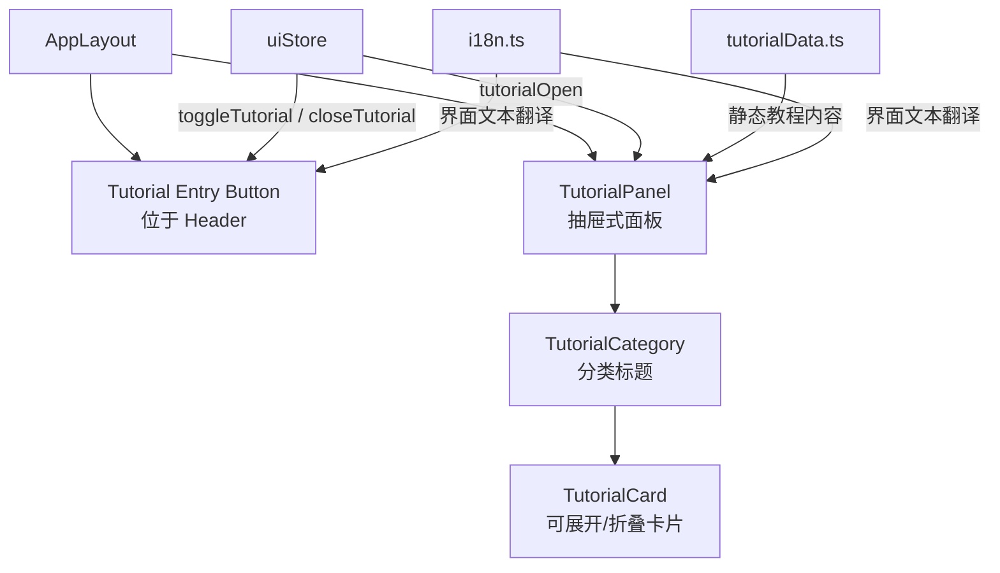

# 技术设计文档：简历教程面板

## 概述

简历教程面板（Resume Tutorial Panel）为 Flash Resume 用户提供内置的简历撰写教程和优化建议。该功能以抽屉式面板的形式从屏幕右侧滑出，包含分类教程内容（简历入门、简历优化、简历润色），每个教程以可展开/折叠的卡片形式呈现。

该功能需要与现有的 UI 状态管理（Zustand uiStore）、国际化系统（i18n）、主题系统（深色/浅色模式）以及响应式布局无缝集成。

### 设计决策

1. **状态管理**：教程面板的开关状态通过 Zustand uiStore 管理，与 galleryOpen 等现有模式保持一致
2. **教程数据**：教程内容以静态数据文件形式存储，支持中英文双语，无需后端 API
3. **组件位置**：教程面板组件放置在 `src/components/Tutorial/` 目录下，遵循项目现有的组件组织结构
4. **样式方案**：使用 Tailwind CSS，与项目现有样式方案一致

## 架构



### 集成点

- **AppLayout Header**：在 header 右侧按钮区域添加教程入口按钮，位于 ThemeToggle 旁边
- **AppLayout Body**：在 AppLayout 组件底部（与 IndustryGalleryOverlay 同级）渲染 TutorialPanel
- **uiStore**：新增 `tutorialOpen` 状态和 `openTutorial` / `closeTutorial` 方法
- **i18n**：在 translations 对象中新增教程相关的翻译键值

## 组件与接口

### 1. TutorialPanel 组件

主面板组件，以抽屉形式从右侧滑出。

```typescript
// src/components/Tutorial/TutorialPanel.tsx
interface TutorialPanelProps {}

export default function TutorialPanel(): JSX.Element | null
```

职责：
- 从 uiStore 读取 `tutorialOpen` 状态，控制显示/隐藏
- 渲染遮罩层（backdrop），点击遮罩关闭面板
- 渲染标题栏（含标题文本和关闭按钮）
- 遍历教程分类数据，渲染 TutorialCategory 组件
- 支持 Escape 键关闭面板
- 面板内容区域支持垂直滚动
- 移动端全屏宽度显示

### 2. TutorialCard 组件

单个教程条目的可展开/折叠卡片。

```typescript
// src/components/Tutorial/TutorialCard.tsx
interface TutorialCardProps {
  title: string;
  content: string;
}

export default function TutorialCard({ title, content }: TutorialCardProps): JSX.Element
```

职责：
- 管理自身的展开/折叠状态（本地 useState）
- 折叠时仅显示标题和箭头指示器
- 展开时显示完整教程内容
- 点击标题区域切换展开/折叠状态

### 3. 教程入口按钮

在 AppLayout header 中直接添加，无需独立组件。

```typescript
// 在 AppLayout.tsx header 的按钮区域中添加
<button
  type="button"
  onClick={() => useUIStore.getState().openTutorial()}
  aria-label={t.tutorialButton}
>
  📖
</button>
```

### 4. uiStore 扩展

```typescript
// 新增到 UIStoreState 接口
tutorialOpen: boolean;
openTutorial: () => void;
closeTutorial: () => void;
```

### 5. 教程数据结构

```typescript
// src/data/tutorialData.ts
export interface TutorialItem {
  titleZh: string;
  titleEn: string;
  contentZh: string;
  contentEn: string;
}

export interface TutorialCategoryData {
  categoryKeyZh: string;
  categoryKeyEn: string;
  items: TutorialItem[];
}

export const TUTORIAL_DATA: TutorialCategoryData[]
```

### 6. i18n 扩展

```typescript
// 新增翻译键
tutorialButton: string;      // "简历教程" / "Resume Tutorial"
tutorialTitle: string;        // "简历教程" / "Resume Tutorial"
closeTutorial: string;        // "关闭" / "Close"
```

## 数据模型

### 教程数据

教程内容以静态常量形式定义在 `src/data/tutorialData.ts` 中，包含三个分类：

| 分类 | 中文名 | 英文名 | 教程条目数 |
|------|--------|--------|-----------|
| 简历入门 | 简历入门 | Getting Started | 4 |
| 简历优化 | 简历优化 | Resume Optimization | 4 |
| 简历润色 | 简历润色 | Resume Polishing | 4 |

每个教程条目包含：
- `titleZh` / `titleEn`：中英文标题
- `contentZh` / `contentEn`：中英文内容（纯文本）

### UI 状态

| 状态 | 类型 | 存储位置 | 说明 |
|------|------|---------|------|
| tutorialOpen | boolean | uiStore | 面板是否打开 |
| expandedCards | local state | TutorialCard | 各卡片展开/折叠状态 |

教程面板的开关状态不需要持久化到 localStorage，每次打开应用时默认关闭。


## 正确性属性（Correctness Properties）

*属性是指在系统所有有效执行中都应保持为真的特征或行为——本质上是关于系统应该做什么的形式化声明。属性是人类可读规范与机器可验证正确性保证之间的桥梁。*

### Property 1: 分类下的教程卡片完整渲染

*For any* 教程分类（TutorialCategoryData），当面板渲染该分类时，该分类下的所有教程条目（items）都应被渲染为 TutorialCard，且渲染的卡片数量等于该分类的 items 数组长度。

**Validates: Requirements 3.3**

### Property 2: 教程卡片默认折叠

*For any* TutorialCard，其初始渲染状态应为折叠状态，即仅显示标题文本，不显示详细内容文本。

**Validates: Requirements 4.1**

### Property 3: 教程卡片点击切换（展开/折叠往返）

*For any* TutorialCard，点击一次应从折叠变为展开（显示内容），再点击一次应从展开变回折叠（隐藏内容），恢复到初始状态。这是一个往返属性（round-trip property）。

**Validates: Requirements 4.2, 4.3**

## 错误处理

| 场景 | 处理方式 |
|------|---------|
| 教程数据为空 | 面板显示空状态，不崩溃 |
| 教程内容文本过长 | 面板内容区域支持滚动，不溢出 |
| 快速连续点击入口按钮 | 状态切换由 Zustand 保证原子性，不会出现中间状态 |
| 面板打开时切换语言 | 面板内容实时跟随语言切换，通过 useLocale hook 响应 |
| 面板打开时切换主题 | 面板样式实时跟随主题切换，通过 Tailwind dark: 前缀实现 |

## 测试策略

### 测试框架

- **单元测试**：Vitest + React Testing Library（项目已有配置）
- **属性测试**：fast-check（项目已安装 `fast-check@^4.6.0`）

### 单元测试

单元测试覆盖具体示例和边界情况：

1. **TutorialPanel 渲染测试**
   - 面板关闭时不渲染任何内容
   - 面板打开时渲染标题和关闭按钮
   - 点击关闭按钮调用 closeTutorial
   - 点击遮罩层调用 closeTutorial
   - Escape 键关闭面板
   - 渲染所有三个分类标题

2. **教程入口按钮测试**
   - 按钮存在于 header 中
   - 按钮包含 aria-label
   - 点击按钮切换面板状态

3. **TutorialCard 渲染测试**
   - 展开/折叠状态的视觉指示器正确显示

4. **教程数据完整性测试**
   - 三个分类各包含 4 个教程条目
   - 每个条目包含中英文标题和内容
   - 需求 5/6/7 中指定的具体教程主题存在

5. **国际化测试**
   - 中文环境下显示中文标题
   - 英文环境下显示英文标题

6. **移动端适配测试**
   - 移动端视口下面板全屏宽度
   - 入口按钮触摸目标 >= 44×44px

### 属性测试

属性测试使用 fast-check 验证通用属性，每个属性测试至少运行 100 次迭代。

1. **Property 1 测试**
   - Tag: **Feature: resume-tutorial-panel, Property 1: 分类下的教程卡片完整渲染**
   - 生成随机的 TutorialCategoryData（随机数量的 items），渲染后验证卡片数量与 items 数量一致

2. **Property 2 测试**
   - Tag: **Feature: resume-tutorial-panel, Property 2: 教程卡片默认折叠**
   - 生成随机的 TutorialItem（随机标题和内容字符串），渲染 TutorialCard 后验证内容不可见

3. **Property 3 测试**
   - Tag: **Feature: resume-tutorial-panel, Property 3: 教程卡片点击切换**
   - 生成随机的 TutorialItem，渲染 TutorialCard，点击一次验证内容可见，再点击一次验证内容不可见

### 测试文件位置

- `src/components/Tutorial/__tests__/TutorialPanel.test.tsx` - 面板单元测试
- `src/components/Tutorial/__tests__/TutorialCard.test.tsx` - 卡片单元测试
- `src/components/Tutorial/__tests__/TutorialCard.property.test.tsx` - 卡片属性测试
- `src/data/__tests__/tutorialData.test.ts` - 教程数据完整性测试
