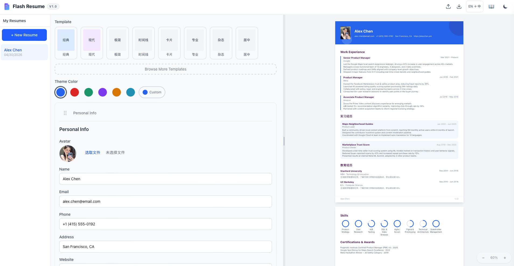
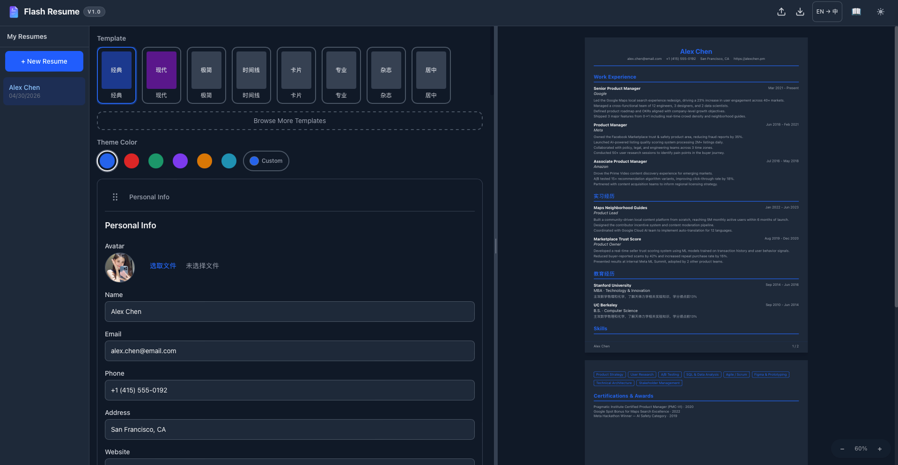
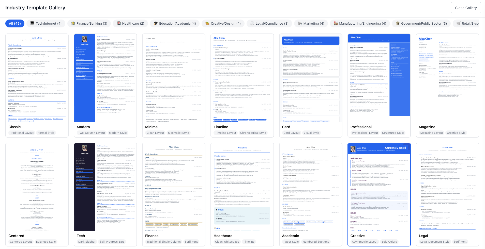

# Flash Resume

[中文](./README.md) | [English](./README.en.md)

浏览器端简历编辑器，基于 React + TypeScript 构建，支持本地存储、实时预览、多模板切换，以及 `PDF / PNG / JPG / JSON` 导出。

## 预览

<p align="center">
  
  
</p>

<p align="left">
  
</p>

## 功能

- 多简历管理：创建、切换、重命名、删除多份简历
- 实时预览：左侧编辑，右侧 A4 比例预览，支持缩放
- 24 套行业模板：科技、金融、医疗、法律、教育、政府、零售、物流等
- 模板画廊：按行业筛选模板
- 主题色自定义：通过取色器调整主色
- 模块拖拽排序：基于 `dnd-kit`
- 自定义区块：支持富文本内容
- 本地存储：数据自动保存到 `localStorage`
- 中英文切换：标签与日期格式支持中 / 英文
- 导出：支持 `PDF / PNG / JPG / JSON`
- 教程面板：内置简历写作提示
- 深色模式：支持 Light / Dark 主题
- 响应式布局：适配桌面与移动端

## 技术栈

| 类别 | 技术 |
|------|------|
| 框架 | React 19 + TypeScript |
| 构建 | Vite 8 |
| 样式 | Tailwind CSS 4 |
| 状态管理 | Zustand |
| 拖拽 | `@dnd-kit/core` + `@dnd-kit/sortable` |
| 导出 | `html-to-image` + `jsPDF` + Web Worker |
| 测试 | Vitest + Testing Library + fast-check |
| 代码规范 | ESLint + TypeScript ESLint |

## 架构说明

### 前端结构

- `components/Editor`：表单编辑区，包括个人信息、经历、教育、项目、技能、自定义区块
- `components/Preview`：A4 预览面板和模板组件
- `components/Gallery`：模板画廊与筛选面板
- `components/Layout`：整体布局、导出栏、侧边栏、移动端导航
- `components/Tutorial`：简历写作教程面板
- `components/UI`：通用 UI 组件

### 状态管理

- `resumeStore`：简历数据、模板、主题色、多简历列表
- `uiStore`：界面状态、Toast、教程面板、当前 Tab、主题模式

### 服务层

- `storageService`：`localStorage` 读写
- `templateRegistry`：模板注册与查询
- `exportService`：图片 / PDF / JSON 导出入口
- `renderEngine`：DOM 到 Canvas / DataURL 的渲染封装
- `pdfWorker` / `pdfWorkerClient`：PDF 组装与 Worker 通信
- `importService`：JSON 导入
- `validationService`：表单与数据校验

## PDF 导出链路

PDF 导出不是直接拼接 DOM，而是采用两段式处理：

1. 预览 DOM 被克隆到离屏容器
2. 使用 `html-to-image` 将 DOM 渲染为高分辨率位图
3. 多页内容按分页断点切片
4. 页面位图发送到 Web Worker
5. Worker 内使用 `jsPDF` 组装 PDF，避免主线程阻塞

当前实现特点：

- 导出结果尽量贴近预览
- 支持多页分页
- 支持导出进度反馈
- PDF 组装在 Worker 中执行

## 数据模型

每份简历包含以下模块，均可独立编辑与排序：

- 个人信息：姓名、邮箱、电话、地址、网站、头像
- 工作经历：公司、职位、时间段、描述
- 项目经验：项目名、角色、时间段、描述
- 教育背景：学校、学位、专业、时间段
- 技能专长：技能名称与等级
- 自定义区块：标题 + 富文本内容

数据默认存储在浏览器 `localStorage` 中，无需后端服务。

## 项目结构

```text
src/
├── components/
│   ├── Editor/
│   ├── Gallery/
│   ├── Layout/
│   ├── Preview/
│   ├── Tutorial/
│   └── UI/
├── data/
├── hooks/
├── services/
├── stores/
├── types/
└── utils/
```

## 快速开始

```bash
npm install
npm run dev
```

其他常用命令：

```bash
# 构建
npm run build

# 测试
npm run test

# 代码检查
npm run lint
```

## 开发说明

- 当前界面版本标识为 `v1.0`
- 项目版本号为 `1.0.0`
- 默认会注入一份预设简历数据，便于本地直接查看模板效果
- 移动端编辑页会保留一个离屏预览实例，保证导出时始终有可用 DOM 源

## GA4 访问统计

项目包含可选的 GA4 访问统计与访客角标能力。

前端环境变量：

```bash
VITE_GA_MEASUREMENT_ID=G-XXXXXXXXXX
VITE_VISITOR_COUNT_API_URL=https://your-worker-subdomain.workers.dev/stats
```

Cloudflare Worker 相关文件：

- `cloudflare/ga4-counter-worker.mjs`
- `cloudflare/wrangler.toml.example`

Worker 需要的主要环境变量：

- `GA4_PROPERTY_ID`
- `GA4_START_DATE`
- `GA4_SERVICE_ACCOUNT_EMAIL`
- `GA4_SERVICE_ACCOUNT_PRIVATE_KEY`
- `ALLOWED_ORIGIN`
- `COUNTER_CACHE_TTL`

部署步骤：

```bash
npm install -g wrangler
wrangler login
cd cloudflare
cp wrangler.toml.example wrangler.toml
wrangler secret put GA4_SERVICE_ACCOUNT_EMAIL
wrangler secret put GA4_SERVICE_ACCOUNT_PRIVATE_KEY
wrangler deploy
```

## License

CC BY-NC 4.0  
详见 [Creative Commons BY-NC 4.0](https://creativecommons.org/licenses/by-nc/4.0/)。

## QA

问题排查记录见 [QA.md](./QA.md)
